# Sketch Health - System Architecture

## System Overview

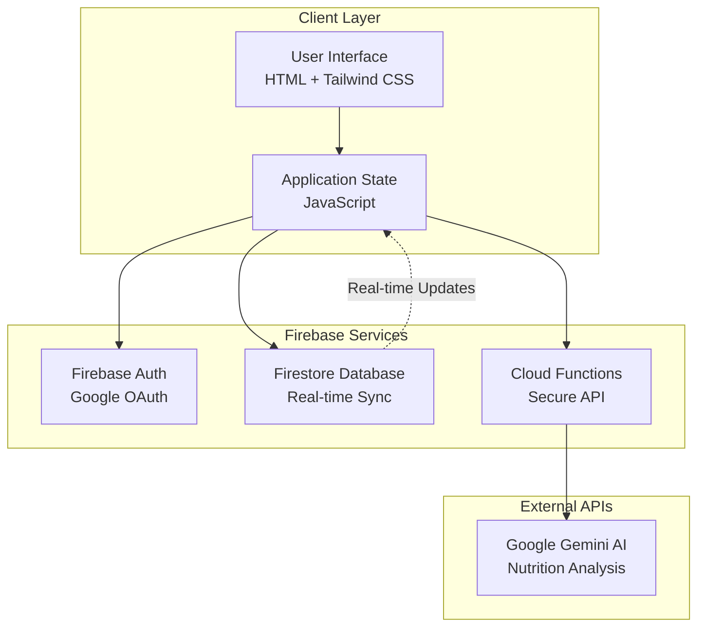

## Data Flow Architecture

### Current State (Pre-Enhancement)

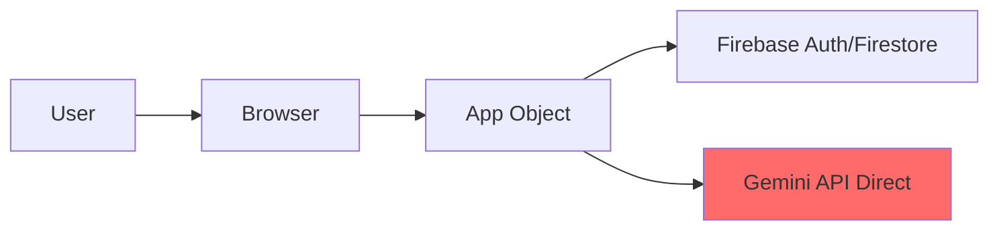

### Target State (Post-Enhancement)

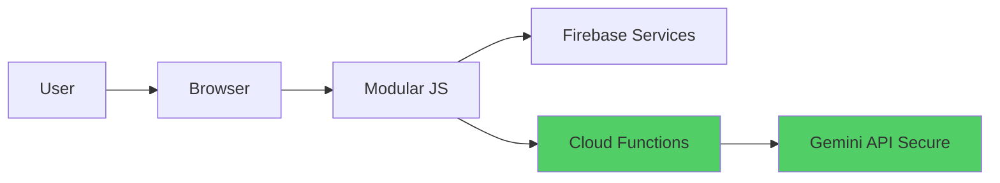

## Component Architecture

### Phase 1: Core Components

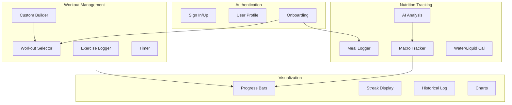

## Database Schema Evolution

### Before Enhancements

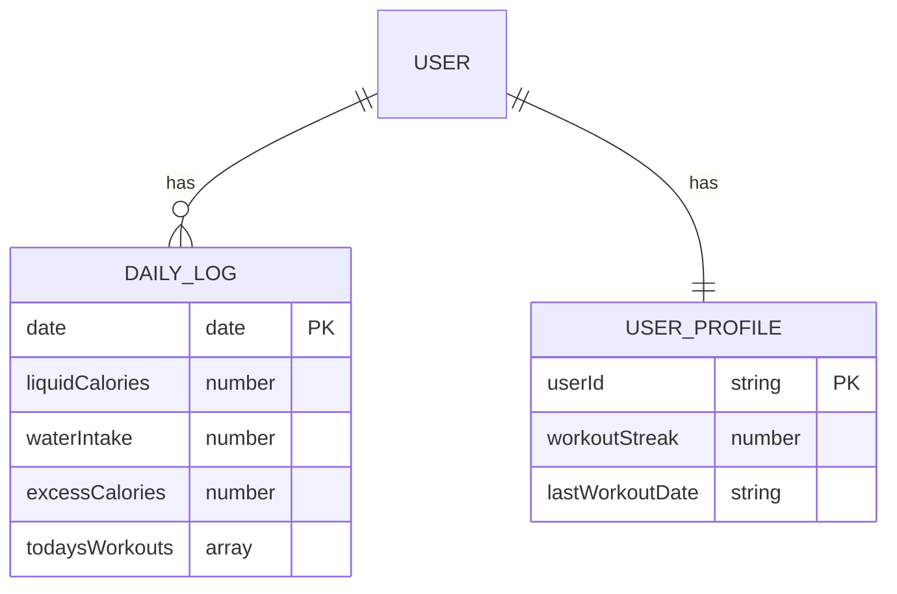

### After Phase 1 Enhancements

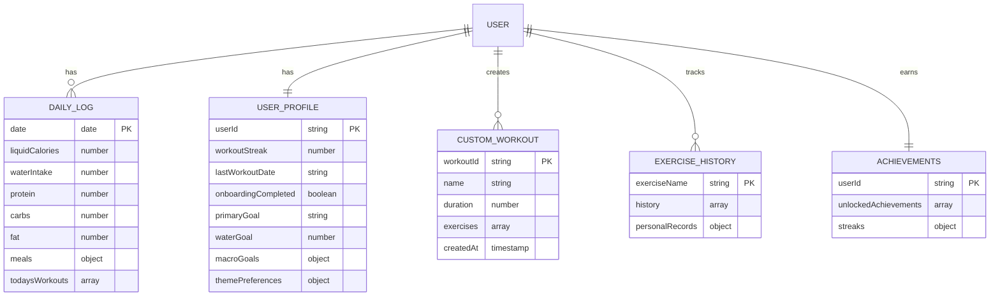

## Feature Dependency Map

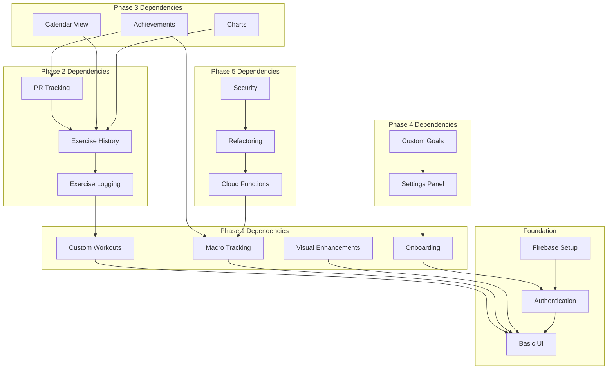

## User Journey Map

### New User Flow

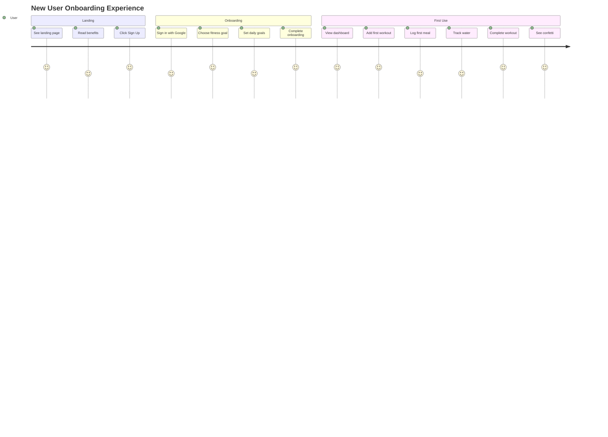

### Returning User Flow

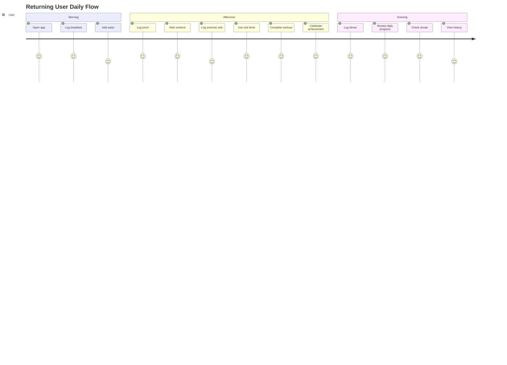

## API Integration Pattern

### Nutrition Analysis Flow

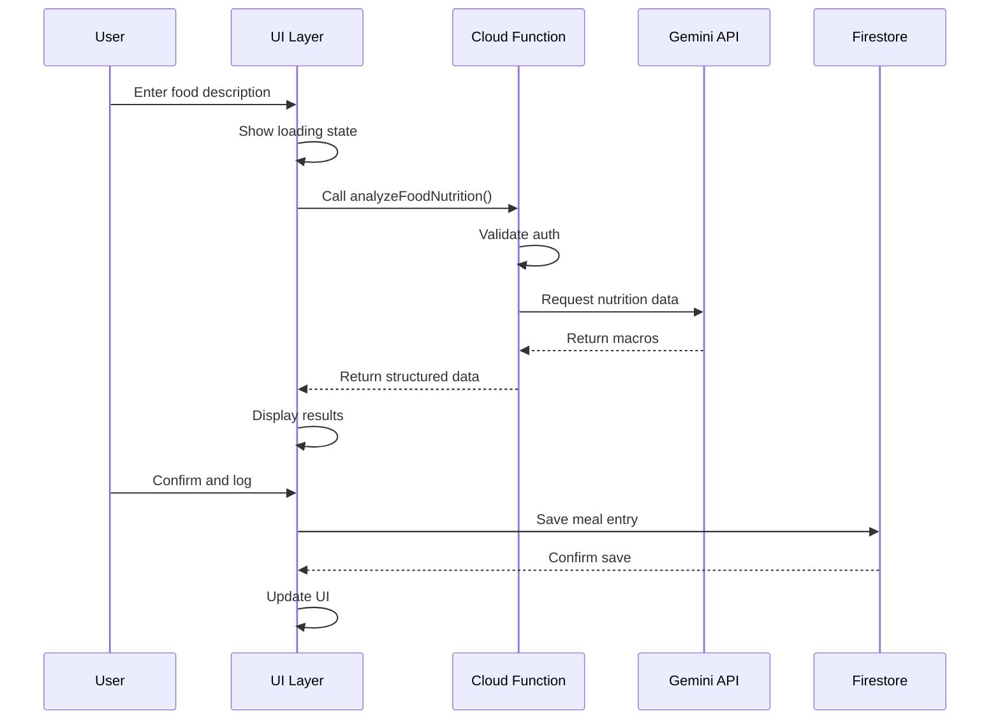

### Exercise History Flow

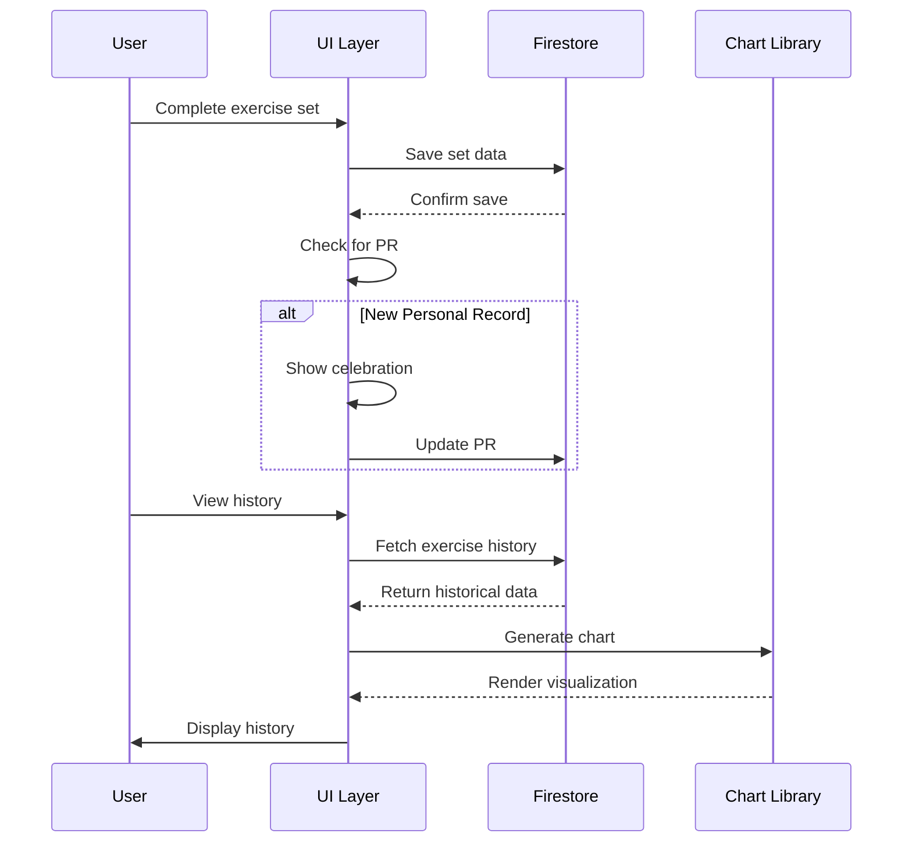

## State Management Strategy

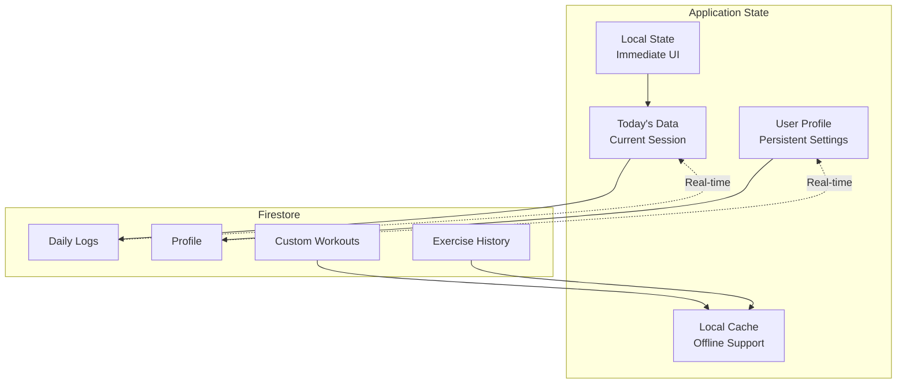

## Security Architecture

### Current Issues (To Be Fixed in Phase 5)

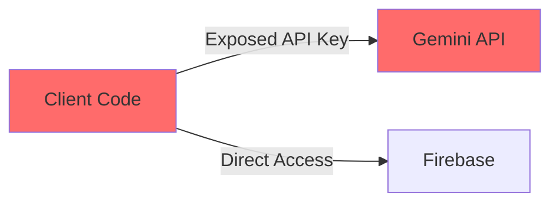

### Target Security Model

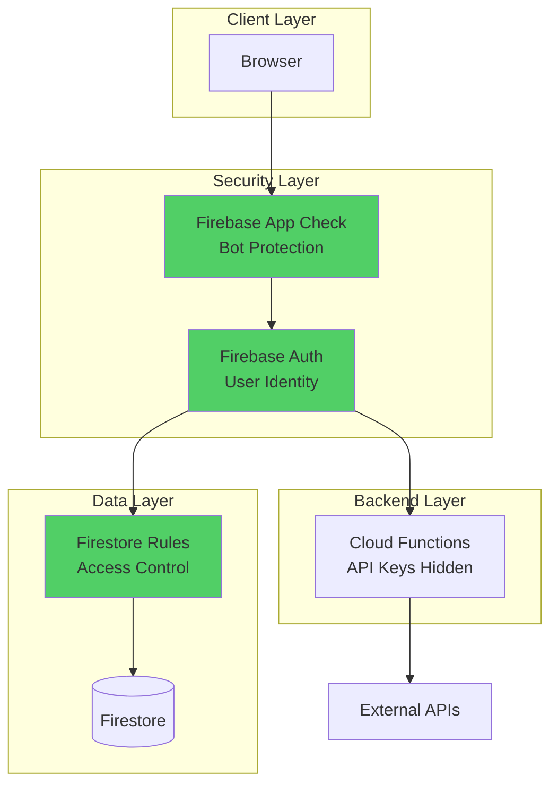

## Performance Optimization Strategy

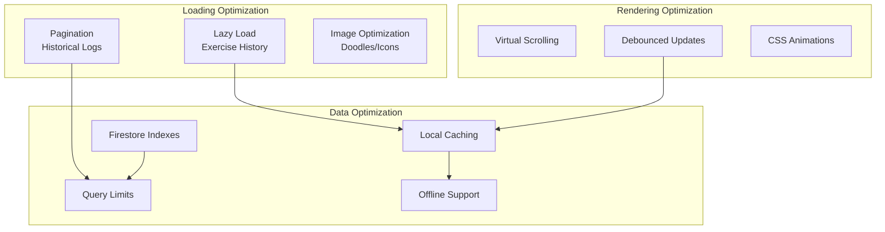

## Module Structure (Phase 5)

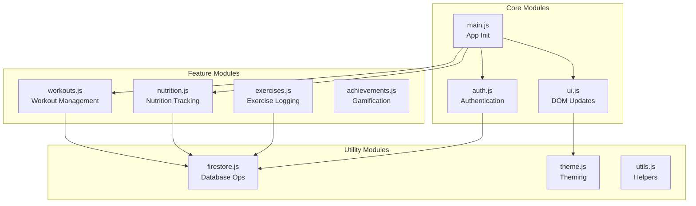

## Testing Strategy

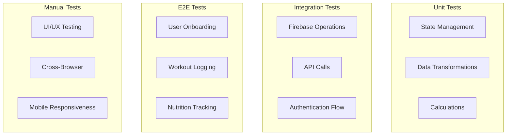

## Deployment Pipeline

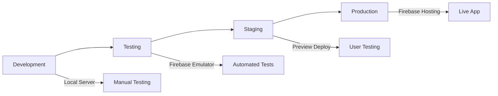

## Key Technical Decisions

### Technology Stack

| Layer | Technology | Reasoning |
|-------|-----------|-----------|
| Frontend | HTML/CSS/JS | Simple, no build step needed initially |
| Styling | Tailwind CSS | Rapid prototyping, utility-first |
| Database | Firestore | Real-time sync, easy setup |
| Auth | Firebase Auth | Google OAuth integration |
| Functions | Cloud Functions | Serverless, auto-scaling |
| AI | Google Gemini | Powerful, cost-effective |
| Charts | Chart.js | Lightweight, well-documented |

### Design Patterns

| Pattern | Use Case |
|---------|----------|
| Observer | Real-time Firestore listeners |
| Factory | Creating workout instances |
| Singleton | App state management |
| Strategy | Different workout types |
| Decorator | Theme customization |

### Data Storage Strategy

| Data Type | Storage Location | Sync Strategy |
|-----------|-----------------|---------------|
| Today's data | Firestore + Local State | Real-time |
| User profile | Firestore | Real-time |
| Custom workouts | Firestore + Local Cache | On-demand |
| Exercise history | Firestore | Lazy load |
| Achievements | Firestore | On login |
| Theme preferences | Firestore + LocalStorage | Immediate |

## Progressive Enhancement Approach

1. **Core Experience** (Works everywhere)
   - Basic workout logging
   - Simple nutrition tracking
   - Manual data entry

2. **Enhanced Experience** (Modern browsers)
   - Real-time sync
   - AI nutrition analysis
   - Smooth animations

3. **Premium Experience** (Latest browsers)
   - Advanced charts
   - Offline support
   - Push notifications

## Migration Strategy

### Phase 1 to Phase 2

```javascript
// Add migration function to handle schema changes
async function migrateToPhase2() {
  // Convert simple exercise completion to detailed logging
  const workouts = await getDocs(dailyLogsRef);
  workouts.forEach(async (doc) => {
    const data = doc.data();
    if (data.todaysWorkouts) {
      // Transform old format to new format
      const updatedWorkouts = data.todaysWorkouts.map(workout => ({
        ...workout,
        exerciseData: workout.completedExercises ? 
          convertToDetailedLogs(workout.completedExercises) : {}
      }));
      await updateDoc(doc.ref, { todaysWorkouts: updatedWorkouts });
    }
  });
}
```

## Scalability Considerations

### Database Design

- Use subcollections for exercise history (better query performance)
- Implement data archiving after 1 year
- Use Firestore aggregate queries for statistics
- Implement pagination for all lists

### Code Organization

- Keep modules under 500 lines
- Use lazy loading for heavy features
- Implement code splitting for large dependencies
- Use service workers for offline support

### Cost Optimization

- Cache frequently accessed data
- Batch Firestore writes where possible
- Use Gemini Flash model for nutrition (faster, cheaper)
- Implement rate limiting for API calls

## Future Considerations

### Potential Enhancements (Beyond Phase 5)

1. **Social Features**
   - Share workouts with friends
   - Compete on leaderboards
   - Follow other users

2. **Advanced Analytics**
   - Body measurements tracking
   - Progress photos
   - AI workout recommendations

3. **Integration**
   - Connect with fitness trackers
   - Import from other apps
   - Export to spreadsheets

4. **Monetization**
   - Premium features
   - Personal training marketplace
   - Nutrition coaching

## Success Metrics

### Phase 1 KPIs

- Onboarding completion rate > 80%
- Custom workout creation rate > 50%
- Daily active users
- Average session duration
- Feature adoption rate

### Technical Metrics

- Page load time < 2s
- Time to interactive < 3s
- First contentful paint < 1s
- API response time < 500ms
- Crash-free rate > 99%

---

## Quick Reference

### File Structure After Refactoring

```
health-dashboard/
├── index.html                 # Main HTML file
├── IMPLEMENTATION_PLAN.md     # Detailed implementation plan
├── ARCHITECTURE.md           # This file
├── README.md                 # Project documentation
│
├── js/
│   ├── main.js              # App initialization
│   ├── auth.js              # Authentication logic
│   ├── firestore.js         # Database operations
│   ├── ui.js                # UI rendering
│   ├── workouts.js          # Workout management
│   ├── nutrition.js         # Nutrition tracking
│   ├── exercises.js         # Exercise logging
│   ├── achievements.js      # Gamification
│   ├── theme.js             # Theme management
│   └── utils.js             # Utility functions
│
├── css/
│   ├── theme.css            # Theme and colors
│   ├── components.css       # Component styles
│   └── animations.css       # Animation definitions
│
├── assets/
│   ├── doodles/            # SVG doodles
│   └── icons/              # App icons
│
└── functions/
    ├── index.js             # Cloud Functions
    └── package.json         # Function dependencies
```

### Command Quick Reference

```bash
# Development
python -m http.server 8000  # Start local server

# Firebase (Phase 5)
firebase init                # Initialize Firebase
firebase deploy              # Deploy to production
firebase deploy --only functions  # Deploy only functions
firebase emulators:start     # Start local emulators

# Testing
npm test                     # Run unit tests (Phase 5)
```

### Resource Links

- [Firebase Documentation](https://firebase.google.com/docs)
- [Firestore Security Rules](https://firebase.google.com/docs/firestore/security/get-started)
- [Google Gemini API](https://ai.google.dev/docs)
- [Chart.js Documentation](https://www.chartjs.org/docs/latest/)
- [Tailwind CSS](https://tailwindcss.com/docs)